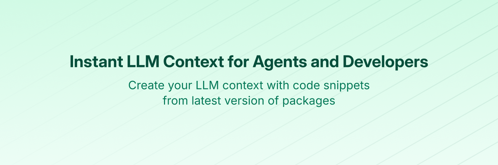

# Context7 MCP Documentation - AI Model Comparison

**🤖 Dual AI Documentation Example**: This repository showcases documentation creation using two different AI models with [Desktop Commander](https://desktopcommander.app/):

- **🔸 Gemini 2.5 Flash**: Traditional markdown documentation → [View Gemini Docs](./Context7_Docs/00_Index.md)
- **🔸 Claude Sonnet 4**: Obsidian-style vault with GitHub compatibility → [View Claude Vault](./obsidian-vault/README.md)

**📺 Live Stream**: Both documentation systems were created during a live coding session: [YouTube Stream](https://www.youtube.com/live/523coCdL8ZI)

**⚡ Powered By**: [Desktop Commander](https://desktopcommander.app/) - The MCP server that enabled direct file system manipulation and automation.

---

## 📊 Documentation Comparison

| Feature | Gemini 2.5 Flash | Claude Sonnet 4 |
|---------|------------------|------------------|
| **Style** | Traditional Markdown | Obsidian Vault |
| **Structure** | Hierarchical Folders | MOC + Cross-linking |
| **GitHub Compatibility** | ✅ Native | ✅ Auto-converted |
| **Obsidian Compatibility** | ⚠️ Basic | ✅ Full Featured |
| **Navigation** | Linear | Graph-based |
| **Link Conversion** | Not needed | Automated system |

## 🎯 Choose Your Documentation Style

### 📁 **Gemini's Traditional Approach**
**[→ Explore Gemini Documentation](./Context7_Docs/00_Index.md)**

- Clean, hierarchical structure
- Platform-agnostic markdown
- Traditional technical writing approach
- Direct GitHub compatibility

### 🕸️ **Claude's Obsidian Vault**
**[→ Explore Claude Vault](./obsidian-vault/README.md)**

- Knowledge graph with interconnected notes
- MOC (Map of Content) organization
- Advanced cross-referencing
- Dual Obsidian + GitHub compatibility

---

## 🚀 About Context7 MCP



Context7 MCP is a Model Context Protocol (MCP) server that provides **up-to-date documentation and code examples** for any library directly in your AI coding environment.

[](https://context7.com) [](https://smithery.ai/server/@upstash/context7-mcp) [](https://www.npmjs.com/package/@upstash/context7-mcp) [](./LICENSE)

[](https://cursor.com/en/install-mcp?name=context7&config=eyJ1cmwiOiJodHRwczovL21jcC5jb250ZXh0Ny5jb20vbWNwIn0%3D) [](https://insiders.vscode.dev/redirect?url=vscode%3Amcp%2Finstall%3F%7B%22name%22%3A%22context7%22%2C%22command%22%3A%22npx%22%2C%22args%22%3A%5B%22-y%22%2C%22%40upstash%2Fcontext7-mcp%40latest%22%5D%7D)

## 🔄 Documentation Experiment: AI Model Comparison

This repository serves as a **live comparison** of how different AI models approach documentation creation when given the same task and tools.

## 🛠️ About Desktop Commander

[Desktop Commander](https://desktopcommander.app/) is the MCP server that made this entire documentation experiment possible. It provides Claude and other AI assistants with direct access to:

- **📁 File System**: Read, write, create, and organize files and directories
- **🔍 Search Operations**: Find and analyze content across projects
- **🏃 Process Management**: Execute commands and scripts
- **📊 Data Processing**: Handle various file formats (CSV, JSON, etc.)
- **🔗 Git Operations**: Commit, push, and manage version control

**Both documentation systems in this repository were created using Desktop Commander**, demonstrating its power for complex, multi-file operations.

## 🎯 Fork Information

This is a fork of [upstash/context7](https://github.com/upstash/context7) created to showcase different AI approaches to documentation. The original Context7 functionality remains intact.

## ❌ Without Context7

LLMs rely on outdated or generic information about the libraries you use. You get:

- ❌ Code examples are outdated and based on year-old training data
- ❌ Hallucinated APIs that don't even exist
- ❌ Generic answers for old package versions

## ✅ With Context7

Context7 MCP pulls up-to-date, version-specific documentation and code examples straight from the source — and places them directly into your prompt.

Add `use context7` to your prompt in Cursor:

```txt
Create a Next.js middleware that checks for a valid JWT in cookies and redirects unauthenticated users to `/login`. use context7
```

```txt
Configure a Cloudflare Worker script to cache JSON API responses for five minutes. use context7
```

Context7 fetches up-to-date code examples and documentation right into your LLM's context.

- 1️⃣ Write your prompt naturally
- 2️⃣ Tell the LLM to `use context7`
- 3️⃣ Get working code answers

No tab-switching, no hallucinated APIs that don't exist, no outdated code generation.

## 📚 Adding Projects

Check out our [project addition guide](./docs/adding-projects.md) to learn how to add (or update) your favorite libraries to Context7.

## 🛠️ Installation

### Requirements

- Node.js >= v18.0.0
- Cursor, Claude Code, VSCode, Windsurf or another MCP Client
- Context7 API Key (Optional for higher rate limits) (Get yours by creating an account at [context7.com/dashboard](https://context7.com/dashboard))

> [!WARNING]
> **SSE Protocol Deprecation Notice**
>
> The Server-Sent Events (SSE) transport protocol is deprecated and its endpoint will be removed in upcoming releases. Please use HTTP or stdio transport methods instead.

<details>
<summary><b>Installing via Smithery</b></summary>

To install Context7 MCP Server for any client automatically via [Smithery](https://smithery.ai/server/@upstash/context7-mcp):

```bash
npx -y @smithery/cli@latest install @upstash/context7-mcp --client <CLIENT_NAME> --key <YOUR_SMITHERY_KEY>
```

You can find your Smithery key in the [Smithery.ai webpage](https://smithery.ai/server/@upstash/context7-mcp).

</details>

<details>
<summary><b>Install in Cursor</b></summary>

Go to: `Settings` -> `Cursor Settings` -> `MCP` -> `Add new global MCP server`

Pasting the following configuration into your Cursor `~/.cursor/mcp.json` file is the recommended approach. You may also install in a specific project by creating `.cursor/mcp.json` in your project folder. See [Cursor MCP docs](https://docs.cursor.com/context/model-context-protocol) for more info.

> Since Cursor 1.0, you can click the install button below for instant one-click installation.

#### Cursor Remote Server Connection

[](https://cursor.com/en/install-mcp?name=context7&config=eyJ1cmwiOiJodHRwczovL21jcC5jb250ZXh0Ny5jb20vbWNwIn0%3D)

```json
{
  "mcpServers": {
    "context7": {
      "url": "https://mcp.context7.com/mcp",
      "headers": {
        "CONTEXT7_API_KEY": "YOUR_API_KEY"
      }
    }
  }
}
```

#### Cursor Local Server Connection

[](https://cursor.com/en/install-mcp?name=context7&config=eyJjb21tYW5kIjoibnB4IC15IEB1c3B0YXNoL2NvbnRleHQ3LW1jcCJ9)

```json
{
  "mcpServers": {
    "context7": {
      "command": "npx",
      "args": ["-y", "@upstash/context7-mcp", "--api-key", "YOUR_API_KEY"]
    }
  }
}
```

</details>

<details>
<summary><b>Install in Claude Code</b></summary>

Run this command. See [Claude Code MCP docs](https://docs.anthropic.com/en/docs/claude-code/mcp) for more info.

#### Claude Code Remote Server Connection

```sh
claude mcp add --transport http context7 https://mcp.context7.com/mcp --header "CONTEXT7_API_KEY: YOUR_API_KEY"
```

#### Claude Code Local Server Connection

```sh
claude mcp add context7 -- npx -y @upstash/context7-mcp --api-key YOUR_API_KEY
```

</details>

<details>
<summary><b>Install in Windsurf</b></summary>

Add this to your Windsurf MCP config file. See [Windsurf MCP docs](https://docs.windsurf.com/windsurf/cascade/mcp) for more info.

#### Windsurf Remote Server Connection

```json
{
  "mcpServers": {
    "context7": {
      "serverUrl": "https://mcp.context7.com/mcp",
      "headers": {
        "CONTEXT7_API_KEY": "YOUR_API_KEY"
      }
    }
  }
}
```

#### Windsurf Local Server Connection

```json
{
  "mcpServers": {
    "context7": {
      "command": "npx",
      "args": ["-y", "@upstash/context7-mcp", "--api-key", "YOUR_API_KEY"]
    }
  }
}
```

</details>

<details>
<summary><b>Install in VS Code</b></summary>

[](https://insiders.vscode.dev/redirect?url=vscode%3Amcp%2Finstall%3F%7B%22name%22%3A%22context7%22%2C%22command%22%3A%22npx%22%2C%22args%22%3A%5B%22-y%22%2C%22%40upstash%2Fcontext7-mcp%40latest%22%5D%7D)
[](https://insiders.vscode.dev/redirect?url=vscode-insiders%3Amcp%2Finstall%3F%7B%22name%22%3A%22context7%22%2C%22command%22%3A%22npx%22%2C%22args%22%3A%5B%22-y%22%2C%22%40upstash%2Fcontext7-mcp%40latest%22%5D%7D)

Add this to your VS Code MCP config file. See [VS Code MCP docs](https://code.visualstudio.com/docs/copilot/chat/mcp-servers) for more info.

#### VS Code Remote Server Connection

```json
"mcp": {
  "servers": {
    "context7": {
      "type": "http",
      "url": "https://mcp.context7.com/mcp",
      "headers": {
        "CONTEXT7_API_KEY": "YOUR_API_KEY"
      }
    }
  }
}
```

#### VS Code Local Server Connection

```json
"mcp": {
  "servers": {
    "context7": {
      "type": "stdio",
      "command": "npx",
      "args": ["-y", "@upstash/context7-mcp", "--api-key", "YOUR_API_KEY"]
    }
  }
}
```

</details>

<details>
<summary>
<b>Install in Cline</b>
</summary>

You can easily install Context7 through the [Cline MCP Server Marketplace](https://cline.bot/mcp-marketplace) by following these instructions:

1. Open **Cline**.
2. Click the hamburger menu icon (☰) to enter the **MCP Servers** section.
3. Use the search bar within the **Marketplace** tab to find _Context7_.
4. Click the **Install** button.

Or you can directly edit MCP servers configuration:

1. Open **Cline**.
2. Click the hamburger menu icon (☰) to enter the **MCP Servers** section.
3. Choose **Remote Servers** tab.
4. Click the **Edit Configuration** button.
5. Add context7 to `mcpServers`:

```json
{
  "mcpServers": {
    "context7": {
      "url": "https://mcp.context7.com/mcp",
      "type": "streamableHttp",
      "headers": {
        "Authorization": "Bearer YOUR_API_KEY"
      }
    }
  }
}
```

</details>

<details>
<summary><b>Install in Zed</b></summary>

It can be installed via [Zed Extensions](https://zed.dev/extensions?query=Context7) or you can add this to your Zed `settings.json`. See [Zed Context Server docs](https://zed.dev/docs/assistant/context-servers) for more info.

```json
{
  "context_servers": {
    "Context7": {
      "command": {
        "path": "npx",
        "args": ["-y", "@upstash/context7-mcp", "--api-key", "YOUR_API_KEY"]
      },
      "settings": {}
    }
  }
}
```

</details>

<details>
<summary><b>Install in Augment Code</b></summary>

To configure Context7 MCP in Augment Code, you can use either the graphical interface or manual configuration.

### **A. Using the Augment Code UI**

1. Click the hamburger menu.
2. Select **Settings**.
3. Navigate to the **Tools** section.
4. Click the **+ Add MCP** button.
5. Enter the following command:

   ```
   npx -y @upstash/context7-mcp@latest
   ```

6. Name the MCP: **Context7**.
7. Click the **Add** button.

Once the MCP server is added, you can start using Context7's up-to-date code documentation features directly within Augment Code.

---

### **B. Manual Configuration**

1. Press Cmd/Ctrl Shift P or go to the hamburger menu in the Augment panel
2. Select Edit Settings
3. Under Advanced, click Edit in settings.json
4. Add the server configuration to the `mcpServers` array in the `augment.advanced` object

```json
"augment.advanced": {
  "mcpServers": [
    {
      "name": "context7",
      "command": "npx",
      "args": ["-y", "@upstash/context7-mcp", "--api-key", "YOUR_API_KEY"]
    }
  ]
}
```

Once the MCP server is added, restart your editor. If you receive any errors, check the syntax to make sure closing brackets or commas are not missing.

</details>

<details>
<summary><b>Install in Roo Code</b></summary>

Add this to your Roo Code MCP configuration file. See [Roo Code MCP docs](https://docs.roocode.com/features/mcp/using-mcp-in-roo) for more info.

#### Roo Code Remote Server Connection

```json
{
  "mcpServers": {
    "context7": {
      "type": "streamable-http",
      "url": "https://mcp.context7.com/mcp"
    }
  }
}
```

#### Roo Code Local Server Connection

```json
{
  "mcpServers": {
    "context7": {
      "command": "npx",
      "args": ["-y", "@upstash/context7-mcp", "--api-key", "YOUR_API_KEY"]
    }
  }
}
```

</details>

<details>
<summary><b>Install in Gemini CLI</b></summary>

See [Gemini CLI Configuration](https://google-gemini.github.io/gemini-cli/docs/tools/mcp-server.html) for details.

1.  Open the Gemini CLI settings file. The location is `~/.gemini/settings.json` (where `~` is your home directory).
2.  Add the following to the `mcpServers` object in your `settings.json` file:

```json
{
  "mcpServers": {
    "context7": {
      "httpUrl": "https://mcp.context7.com/mcp",
      "headers": {
        "CONTEXT7_API_KEY": "YOUR_API_KEY",
        "Accept": "application/json, text/event-stream"
      }
    }
  }
}
```

Or, for a local server:

```json
{
  "mcpServers": {
    "context7": {
      "command": "npx",
      "args": ["-y", "@upstash/context7-mcp", "--api-key", "YOUR_API_KEY"]
    }
  }
}
```

If the `mcpServers` object does not exist, create it.

</details>

<details>
<summary><b>Install in Claude Desktop</b></summary>

#### Remote Server Connection

Open Claude Desktop and navigate to Settings > Connectors > Add Custom Connector. Enter the name as `Context7` and the remote MCP server URL as `https://mcp.context7.com/mcp`.

#### Local Server Connection

Open Claude Desktop developer settings and edit your `claude_desktop_config.json` file to add the following configuration. See [Claude Desktop MCP docs](https://modelcontextprotocol.io/quickstart/user) for more info.

```json
{
  "mcpServers": {
    "context7": {
      "command": "npx",
      "args": ["-y", "@upstash/context7-mcp", "--api-key", "YOUR_API_KEY"]
    }
  }
}
```

</details>

<details>
<summary><b>Install in Opencode</b></summary>

Add this to your Opencode configuration file. See [Opencode MCP docs](https://opencode.ai/docs/mcp-servers) for more info.

#### Opencode Remote Server Connection

```json
"mcp": {
  "context7": {
    "type": "remote",
    "url": "https://mcp.context7.com/mcp",
    "headers": {
      "CONTEXT7_API_KEY": "YOUR_API_KEY"
    },
    "enabled": true
  }
}
```

#### Opencode Local Server Connection

```json
{
  "mcp": {
    "context7": {
      "type": "local",
      "command": ["npx", "-y", "@upstash/context7-mcp", "--api-key", "YOUR_API_KEY"],
      "enabled": true
    }
  }
}
```

</details>
<details>
<summary><b>Install in OpenAI Codex</b></summary>

See [OpenAI Codex](https://github.com/openai/codex) for more information.

Add the following configuration to your OpenAI Codex MCP server settings:

```toml
[mcp_servers.context7]
args = ["-y", "@upstash/context7-mcp", "--api-key", "YOUR_API_KEY"]
command = "npx"
```

</details>

<details>
<summary><b>Install in JetBrains AI Assistant</b></summary>

See [JetBrains AI Assistant Documentation](https://www.jetbrains.com/help/ai-assistant/configure-an-mcp-server.html) for more details.

1. In JetBrains IDEs, go to `Settings` -> `Tools` -> `AI Assistant` -> `Model Context Protocol (MCP)`
2. Click `+ Add`.
3. Click on `Command` in the top-left corner of the dialog and select the As JSON option from the list
4. Add this configuration and click `OK`

```json
{
  "mcpServers": {
    "context7": {
      "command": "npx",
      "args": ["-y", "@upstash/context7-mcp", "--api-key", "YOUR_API_KEY"]
    }
  }
}
```

5. Click `Apply` to save changes.
6. The same way context7 could be added for JetBrains Junie in `Settings` -> `Tools` -> `Junie` -> `MCP Settings`

</details>

<details>
  
<summary><b>Install in Kiro</b></summary>

See [Kiro Model Context Protocol Documentation](https://kiro.dev/docs/mcp/configuration/) for details.

1. Navigate `Kiro` > `MCP Servers`
2. Add a new MCP server by clicking the `+ Add` button.
3. Paste the configuration given below:

```json
{
  "mcpServers": {
    "Context7": {
      "command": "npx",
      "args": ["-y", "@upstash/context7-mcp", "--api-key", "YOUR_API_KEY"],
      "env": {},
      "disabled": false,
      "autoApprove": []
    }
  }
}
```

4. Click `Save` to apply the changes.

</details>

<details>
<summary><b>Install in Trae</b></summary>

Use the Add manually feature and fill in the JSON configuration information for that MCP server.
For more details, visit the [Trae documentation](https://docs.trae.ai/ide/model-context-protocol?_lang=en).

#### Trae Remote Server Connection

```json
{
  "mcpServers": {
    "context7": {
      "url": "https://mcp.context7.com/mcp"
    }
  }
}
```

#### Trae Local Server Connection

```json
{
  "mcpServers": {
    "context7": {
      "command": "npx",
      "args": ["-y", "@upstash/context7-mcp", "--api-key", "YOUR_API_KEY"]
    }
  }
}
```

</details>

<details>
<summary><b>Using Bun or Deno</b></summary>

Use these alternatives to run the local Context7 MCP server with other runtimes. These examples work for any client that supports launching a local MCP server via command + args.

#### Bun

```json
{
  "mcpServers": {
    "context7": {
      "command": "bunx",
      "args": ["-y", "@upstash/context7-mcp", "--api-key", "YOUR_API_KEY"]
    }
  }
}
```

#### Deno

```json
{
  "mcpServers": {
    "context7": {
      "command": "deno",
      "args": [
        "run",
        "--allow-env=NO_DEPRECATION,TRACE_DEPRECATION",
        "--allow-net",
        "npm:@upstash/context7-mcp"
      ]
    }
  }
}
```

</details>

<details>
<summary><b>Using Docker</b></summary>

If you prefer to run the MCP server in a Docker container:

1. **Build the Docker Image:**

   First, create a `Dockerfile` in the project root (or anywhere you prefer):

   <details>
   <summary>Click to see Dockerfile content</summary>

   ```Dockerfile
   FROM node:18-alpine

   WORKDIR /app

   # Install the latest version globally
   RUN npm install -g @upstash/context7-mcp

   # Expose default port if needed (optional, depends on MCP client interaction)
   # EXPOSE 3000

   # Default command to run the server
   CMD ["context7-mcp"]
   ```

   </details>

   Then, build the image using a tag (e.g., `context7-mcp`). **Make sure Docker Desktop (or the Docker daemon) is running.** Run the following command in the same directory where you saved the `Dockerfile`:

   ```bash
   docker build -t context7-mcp .
   ```

2. **Configure Your MCP Client:**

   Update your MCP client's configuration to use the Docker command.

   _Example for a cline_mcp_settings.json:_

   ```json
   {
     "mcpServers": {
       "Сontext7": {
         "autoApprove": [],
         "disabled": false,
         "timeout": 60,
         "command": "docker",
         "args": ["run", "-i", "--rm", "context7-mcp"],
         "transportType": "stdio"
       }
     }
   }
   ```

   _Note: This is an example configuration. Please refer to the specific examples for your MCP client (like Cursor, VS Code, etc.) earlier in this README to adapt the structure (e.g., `mcpServers` vs `servers`). Also, ensure the image name in `args` matches the tag used during the `docker build` command._

</details>

<details>
<summary><b>Install Using the Desktop Extension</b></summary>

Install the [context7.dxt](dxt/context7.dxt) file under the dxt folder and add it to your client. For more information, please check out [the desktop extensions docs](https://github.com/anthropics/dxt#desktop-extensions-dxt).

</details>

<details>
<summary><b>Install in Windows</b></summary>

The configuration on Windows is slightly different compared to Linux or macOS (_`Cline` is used in the example_). The same principle applies to other editors; refer to the configuration of `command` and `args`.

```json
{
  "mcpServers": {
    "github.com/upstash/context7-mcp": {
      "command": "cmd",
      "args": ["/c", "npx", "-y", "@upstash/context7-mcp", "--api-key", "YOUR_API_KEY"],
      "disabled": false,
      "autoApprove": []
    }
  }
}
```

</details>

<details>
<summary><b>Install in Amazon Q Developer CLI</b></summary>

Add this to your Amazon Q Developer CLI configuration file. See [Amazon Q Developer CLI docs](https://docs.aws.amazon.com/amazonq/latest/qdeveloper-ug/command-line-mcp-configuration.html) for more details.

```json
{
  "mcpServers": {
    "context7": {
      "command": "npx",
      "args": ["-y", "@upstash/context7-mcp", "--api-key", "YOUR_API_KEY"]
    }
  }
}
```

</details>

<details>
<summary><b>Install in Warp</b></summary>

See [Warp Model Context Protocol Documentation](https://docs.warp.dev/knowledge-and-collaboration/mcp#adding-an-mcp-server) for details.

1. Navigate `Settings` > `AI` > `Manage MCP servers`.
2. Add a new MCP server by clicking the `+ Add` button.
3. Paste the configuration given below:

```json
{
  "Context7": {
    "command": "npx",
    "args": ["-y", "@upstash/context7-mcp", "--api-key", "YOUR_API_KEY"],
    "env": {},
    "working_directory": null,
    "start_on_launch": true
  }
}
```

4. Click `Save` to apply the changes.

</details>

<details>

<summary><b>Install in Copilot Coding Agent</b></summary>

## Using Context7 with Copilot Coding Agent

Add the following configuration to the `mcp` section of your Copilot Coding Agent configuration file Repository->Settings->Copilot->Coding agent->MCP configuration:

```json
{
  "mcpServers": {
    "context7": {
      "type": "http",
      "url": "https://mcp.context7.com/mcp",
      "headers": {
        "CONTEXT7_API_KEY": "YOUR_API_KEY"
      },
      "tools": ["get-library-docs", "resolve-library-id"]
    }
  }
}
```

For more information, see the [official GitHub documentation](https://docs.github.com/en/enterprise-cloud@latest/copilot/how-tos/agents/copilot-coding-agent/extending-copilot-coding-agent-with-mcp).

</details>

<details>
<summary><b>Install in LM Studio</b></summary>

See [LM Studio MCP Support](https://lmstudio.ai/blog/lmstudio-v0.3.17) for more information.

#### One-click install:

[](https://lmstudio.ai/install-mcp?name=context7&config=eyJjb21tYW5kIjoibnB4IiwiYXJncyI6WyIteSIsIkB1c3B0YXNoL2NvbnRleHQ3LW1jcCJdfQ%3D%3D)

#### Manual set-up:

1. Navigate to `Program` (right side) > `Install` > `Edit mcp.json`.
2. Paste the configuration given below:

```json
{
  "mcpServers": {
    "Context7": {
      "command": "npx",
      "args": ["-y", "@upstash/context7-mcp", "--api-key", "YOUR_API_KEY"]
    }
  }
}
```

3. Click `Save` to apply the changes.
4. Toggle the MCP server on/off from the right hand side, under `Program`, or by clicking the plug icon at the bottom of the chat box.

</details>

<details>
<summary><b>Install in Visual Studio 2022</b></summary>

You can configure Context7 MCP in Visual Studio 2022 by following the [Visual Studio MCP Servers documentation](https://learn.microsoft.com/visualstudio/ide/mcp-servers?view=vs-2022).

Add this to your Visual Studio MCP config file (see the [Visual Studio docs](https://learn.microsoft.com/visualstudio/ide/mcp-servers?view=vs-2022) for details):

```json
{
  "inputs": [],
  "servers": {
    "context7": {
      "type": "http",
      "url": "https://mcp.context7.com/mcp",
      "headers": {
        "CONTEXT7_API_KEY": "YOUR_API_KEY"
      }
    }
  }
}
```

Or, for a local server:

```json
{
  "mcp": {
    "servers": {
      "context7": {
        "type": "stdio",
        "command": "npx",
        "args": ["-y", "@upstash/context7-mcp", "--api-key", "YOUR_API_KEY"]
      }
    }
  }
}
```

For more information and troubleshooting, refer to the [Visual Studio MCP Servers documentation](https://learn.microsoft.com/visualstudio/ide/mcp-servers?view=vs-2022).

</details>

<details>
<summary><b>Install in Crush</b></summary>

Add this to your Crush configuration file. See [Crush MCP docs](https://github.com/charmbracelet/crush#mcps) for more info.

#### Crush Remote Server Connection (HTTP)

```json
{
  "$schema": "https://charm.land/crush.json",
  "mcp": {
    "context7": {
      "type": "http",
      "url": "https://mcp.context7.com/mcp",
      "headers": {
        "CONTEXT7_API_KEY": "YOUR_API_KEY"
      }
    }
  }
}
```

#### Crush Local Server Connection

```json
{
  "$schema": "https://charm.land/crush.json",
  "mcp": {
    "context7": {
      "type": "stdio",
      "command": "npx",
      "args": ["-y", "@upstash/context7-mcp", "--api-key", "YOUR_API_KEY"]
    }
  }
}
```

</details>

<details>
<summary><b>Install in BoltAI</b></summary>

Open the "Settings" page of the app, navigate to "Plugins," and enter the following JSON:

```json
{
  "mcpServers": {
    "context7": {
      "command": "npx",
      "args": ["-y", "@upstash/context7-mcp", "--api-key", "YOUR_API_KEY"]
    }
  }
}
```

Once saved, enter in the chat `get-library-docs` followed by your Context7 documentation ID (e.g., `get-library-docs /nuxt/ui`). More information is available on [BoltAI's Documentation site](https://docs.boltai.com/docs/plugins/mcp-servers). For BoltAI on iOS, [see this guide](https://docs.boltai.com/docs/boltai-mobile/mcp-servers).

</details>

<details>
<summary><b>Install in Rovo Dev CLI</b></summary>

Edit your Rovo Dev CLI MCP config by running the command below -

```bash
acli rovodev mcp
```

Example config -

#### Remote Server Connection

```json
{
  "mcpServers": {
    "context7": {
      "url": "https://mcp.context7.com/mcp"
    }
  }
}
```

#### Local Server Connection

```json
{
  "mcpServers": {
    "context7": {
      "command": "npx",
      "args": ["-y", "@upstash/context7-mcp", "--api-key", "YOUR_API_KEY"]
    }
  }
}
```

</details>

<details>
<summary><b>Install in Zencoder</b></summary>

To configure Context7 MCP in Zencoder, follow these steps:

1. Go to the Zencoder menu (...)
2. From the dropdown menu, select Agent tools
3. Click on the Add custom MCP
4. Add the name and server configuration from below, and make sure to hit the Install button

```json
{
  "command": "npx",
  "args": ["-y", "@upstash/context7-mcp", "--api-key", "YOUR_API_KEY"]
}
```

Once the MCP server is added, you can easily continue using it.

</details>

<details>
<summary><b>Install in Qodo Gen</b></summary>

See [Qodo Gen docs](https://docs.qodo.ai/qodo-documentation/qodo-gen/qodo-gen-chat/agentic-mode/agentic-tools-mcps) for more details.

1. Open Qodo Gen chat panel in VSCode or IntelliJ.
2. Click Connect more tools.
3. Click + Add new MCP.
4. Add the following configuration:

#### Qodo Gen Local Server Connection

```json
{
  "mcpServers": {
    "context7": {
      "command": "npx",
      "args": ["-y", "@upstash/context7-mcp", "--api-key", "YOUR_API_KEY"]
    }
  }
}
```

#### Qodo Gen Remote Server Connection

```json
{
  "mcpServers": {
    "context7": {
      "url": "https://mcp.context7.com/mcp"
    }
  }
}
```

</details>

<details>
<summary><b>Install in Perplexity Desktop</b></summary>

See [Local and Remote MCPs for Perplexity](https://www.perplexity.ai/help-center/en/articles/11502712-local-and-remote-mcps-for-perplexity) for more information.

1. Navigate `Perplexity` > `Settings`
2. Select `Connectors`.
3. Click `Add Connector`.
4. Select `Advanced`.
5. Enter Server Name: `Context7`
6. Paste the following JSON in the text area:

```json
{
  "args": ["-y", "@upstash/context7-mcp", "--api-key", "YOUR_API_KEY"],
  "command": "npx",
  "env": {}
}
```

7. Click `Save`.
</details>

## 🔨 Available Tools

Context7 MCP provides the following tools that LLMs can use:

- `resolve-library-id`: Resolves a general library name into a Context7-compatible library ID.
  - `libraryName` (required): The name of the library to search for

- `get-library-docs`: Fetches documentation for a library using a Context7-compatible library ID.
  - `context7CompatibleLibraryID` (required): Exact Context7-compatible library ID (e.g., `/mongodb/docs`, `/vercel/next.js`)
  - `topic` (optional): Focus the docs on a specific topic (e.g., "routing", "hooks")
  - `tokens` (optional, default 5000): Max number of tokens to return. Values less than 1000 are automatically increased to 1000.
