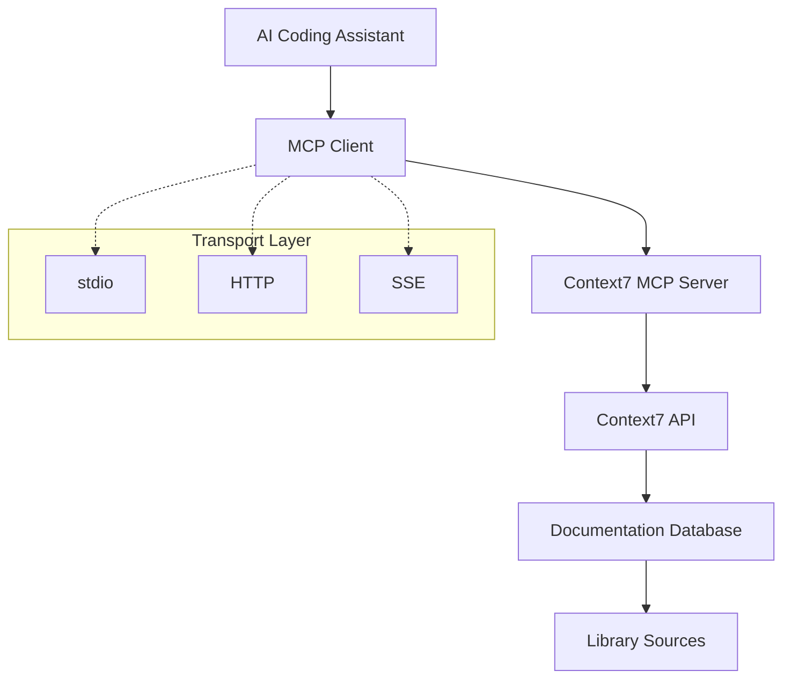

# 🗺️ Project MOC (Map of Content)

*A comprehensive map of all Context7 MCP documentation and resources*

## 🎯 Project Essence

**Context7 MCP** is a Model Context Protocol server that bridges the gap between AI coding assistants and up-to-date library documentation, eliminating the problem of outdated code generation and hallucinated APIs.

### Core Value Proposition
> "No more outdated code examples or hallucinated APIs - get working code answers with current documentation."

## 📊 Project Status Dashboard

| Metric | Status | Notes |
|--------|--------|-------|
| **Version** | 1.0.0 | Current stable release |
| **License** | MIT | Open source |
| **Language** | TypeScript | Node.js runtime |
| **MCP Version** | 1.17.5 | Latest MCP SDK |
| **Maintainer** | @upstash | Primary maintainer |

## 🏗️ Architecture Overview



## 📚 Knowledge Areas

### 🔧 Technical Implementation
- [[02-Architecture/System Architecture|Core Architecture]]
- [[02-Architecture/MCP Protocol Implementation|MCP Integration]]
- [[02-Architecture/Transport Mechanisms|Communication Protocols]]
- [[05-Development/Code Structure|Codebase Organization]]

### 🎮 User Experience
- [[04-Installation/Installation Guide|Getting Started]]
- [[07-Examples/Usage Examples|How to Use]]
- [[07-Examples/Best Practices|Optimization Tips]]
- [[08-Troubleshooting/Common Issues|Problem Solving]]

### 🔌 Integration Points
- [[04-Installation/Cursor Installation|Cursor IDE]]
- [[04-Installation/VS Code Installation|VS Code]]
- [[04-Installation/Claude Desktop Installation|Claude Desktop]]
- [[03-API-Reference/API Overview|Direct API Usage]]## 🌐 Ecosystem Connections

### Dependencies & Tools
- **MCP SDK**: [[03-API-Reference/MCP Protocol Implementation|Protocol Foundation]]
- **Node.js**: [[05-Development/Development Setup|Runtime Environment]]
- **TypeScript**: [[05-Development/Code Structure|Language Choice]]
- **Undici**: [[02-Architecture/Security Model|HTTP Client]]

### Integration Partners
- **Cursor**: [[04-Installation/Cursor Installation|Primary IDE]]
- **VS Code**: [[04-Installation/VS Code Installation|Microsoft IDE]]
- **Claude Code**: [[04-Installation/Claude Desktop Installation|Anthropic Tools]]
- **Windsurf**: [[04-Installation/Installation Guide|Alternative IDE]]

### Community & Resources
- **GitHub Repository**: [upstash/context7](https://github.com/upstash/context7)
- **Documentation Site**: [context7.com](https://context7.com)
- **Discord Community**: [Upstash Discord](https://upstash.com/discord)
- **X/Twitter**: [@context7ai](https://x.com/context7ai)

## 🎯 Learning Paths

### For End Users
1. [[01-Project-Overview/What is Context7|Understand the Problem]]
2. [[04-Installation/Installation Guide|Install for Your IDE]]
3. [[07-Examples/Basic Queries|Try Basic Examples]]
4. [[07-Examples/Advanced Queries|Master Advanced Usage]]
5. [[08-Troubleshooting/FAQ|Handle Common Issues]]

### For Developers
1. [[02-Architecture/System Architecture|Study the Architecture]]
2. [[05-Development/Development Setup|Set Up Dev Environment]]
3. [[05-Development/Code Structure|Explore the Codebase]]
4. [[05-Development/Testing Guide|Run Tests]]
5. [[06-Contributing/Contributing Guide|Make Contributions]]

### For Library Authors
1. [[01-Project-Overview/Use Cases|Understand Benefits]]
2. [[06-Contributing/Adding New Libraries|Add Your Library]]
3. [[06-Contributing/Code of Conduct|Follow Guidelines]]
4. [[07-Examples/Integration Examples|See Examples]]

## 🔄 Information Flow

### User Journey
```
User Query → MCP Client → Context7 Server → Context7 API → Documentation → Response
```

### Development Cycle
```
Code Changes → Testing → Building → Packaging → Distribution → Installation
```

### Documentation Lifecycle
```
Library Updates → Context7 Indexing → API Updates → User Access
```

## 📈 Metrics & KPIs

### Usage Metrics
- Number of supported libraries
- API response times
- User adoption across IDEs
- Documentation freshness

### Quality Metrics
- Test coverage
- Code quality scores
- User satisfaction
- Issue resolution time

---

*This MOC serves as the central nervous system of the Context7 MCP documentation. All paths lead here, and from here, all knowledge is accessible.*

#moc #overview #navigation #context7