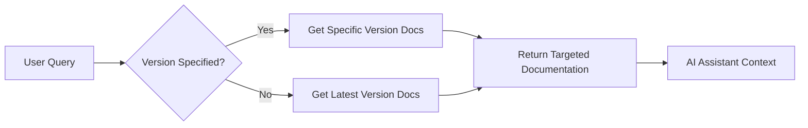
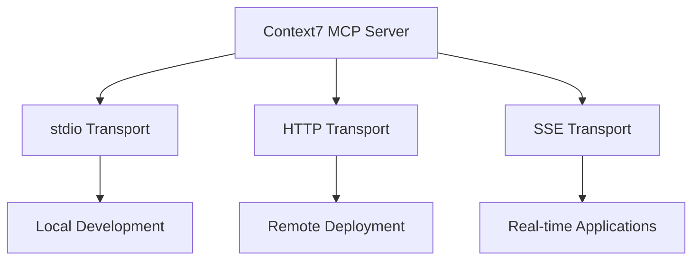

# Key Features

## 🔄 Real-Time Documentation Sync

### Always Up-to-Date
Context7 maintains live connections to library repositories and documentation sources, ensuring you always get the most current information.

**How it works:**
- Continuous monitoring of popular libraries
- Automatic updates when new versions are released
- Smart caching for performance without staleness

**Benefits:**
- No more "this API doesn't exist" errors
- Current best practices and patterns
- Version-specific examples that actually work

### Version-Specific Information


## 🎯 Intelligent Library Resolution

### Smart Search Algorithm
Context7 doesn't just do keyword matching - it understands context and intent.

**Search Intelligence Features:**
- **Fuzzy matching**: Finds libraries even with typos
- **Context awareness**: Understands related technologies
- **Popularity weighting**: Prioritizes widely-used libraries
- **Trust scoring**: Identifies authoritative sources

### Example Search Results
```
Query: "react state management"

Results:
1. /facebook/react (Trust: 10, Snippets: 1,847)
2. /reduxjs/redux (Trust: 9, Snippets: 892) 
3. /pmndrs/zustand (Trust: 8, Snippets: 234)
4. /microsoft/fluentui (Trust: 7, Snippets: 445)
```

## 🎛️ Configurable Detail Level

### Token-Based Control
Fine-tune how much documentation you receive based on your needs.

| Token Range | Use Case | Content Level |
|-------------|----------|---------------|
| 1,000-2,000 | Quick reference | Key APIs only |
| 2,000-5,000 | Standard usage | Common patterns + examples |
| 5,000-10,000 | Deep dive | Comprehensive docs + edge cases |
| 10,000+ | Full context | Everything available |

### Topic Filtering
Get documentation focused on your specific needs:

```typescript
// Focus on authentication
get-library-docs("/supabase/supabase", topic: "authentication")

// Focus on routing
get-library-docs("/vercel/next.js", topic: "routing")

// Focus on state management  
get-library-docs("/facebook/react", topic: "hooks")
```

## 🌐 Multi-Platform Integration

### Supported IDEs and Editors
Context7 works seamlessly across the modern development ecosystem:

#### Primary Support
- **Cursor**: Full integration with one-click install
- **VS Code**: Native MCP support with extensions
- **Claude Desktop**: Direct integration via MCP protocol

#### Extended Support  
- **Windsurf**: Alternative AI-powered editor
- **JetBrains IDEs**: Through AI Assistant plugin
- **Zed**: Modern performance-focused editor
- **Claude Code**: Command-line AI assistant

### Transport Flexibility
Choose the communication method that works best for your setup:



## 🔒 Security & Privacy

### API Key Management
- Optional API keys for higher rate limits
- Secure header-based authentication
- No personal data transmission

### Proxy Support
- Respects corporate proxy settings
- Environment variable configuration
- Transparent tunneling through firewalls

## ⚡ Performance Optimization

### Smart Caching
- Results cached to avoid repeated API calls
- Intelligent cache invalidation
- Configurable cache duration

### Efficient Networking
- HTTP/2 connections where supported
- Connection pooling and reuse
- Retry logic with exponential backoff

### Resource Management
```typescript
// Configurable limits prevent resource exhaustion
const MINIMUM_TOKENS = 1000;
const DEFAULT_TOKENS = 5000; 
const DEFAULT_PORT = 3000;
```