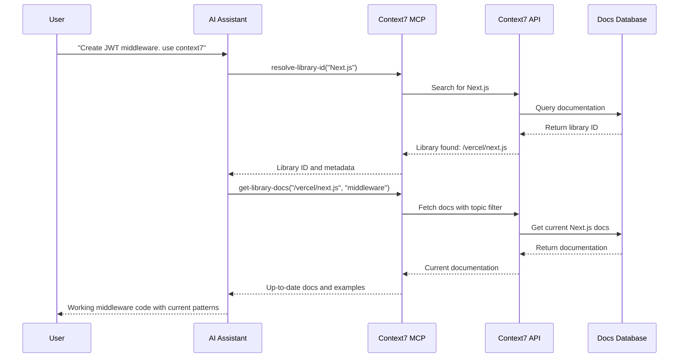

# What is Context7?

## 🎯 The Problem Context7 Solves

### The Pain Point
When you ask an AI coding assistant to help with a specific library, you often get:

- ❌ **Outdated code examples** based on year-old training data
- ❌ **Hallucinated APIs** that don't actually exist
- ❌ **Generic answers** for old package versions
- ❌ **Deprecated patterns** that no longer work

### The Solution
Context7 MCP pulls **up-to-date, version-specific documentation** and code examples straight from the source and places them directly into your AI assistant's context.

## 🔍 What Context7 Actually Does

Context7 is a **Model Context Protocol (MCP) server** that acts as a bridge between your AI coding assistant and a vast database of current library documentation.

### Simple Workflow
1. **You write a prompt**: "Create a Next.js middleware for JWT validation. use context7"
2. **Context7 activates**: Fetches current Next.js documentation
3. **AI gets context**: Receives up-to-date docs and examples
4. **You get results**: Working code based on current best practices

### Under the Hood


## 🌟 Key Features

### Always Current
- Documentation synced with source repositories
- Version-specific information
- No more outdated examples

### Intelligent Library Resolution
- Fuzzy search across thousands of libraries
- Smart matching based on context
- Trust scores and popularity metrics

### Topic-Focused Retrieval
- Get docs relevant to your specific use case
- Filter by functionality (e.g., "routing", "authentication")
- Configurable detail level

### Multi-Platform Support
- Works with Cursor, VS Code, Claude Desktop
- Multiple transport protocols (stdio, HTTP, SSE)
- Easy integration with any MCP-compatible client## 🎮 Real-World Impact

### Before Context7
```javascript
// AI Assistant response based on old training data
app.use('/api', (req, res, next) => {
  // This middleware pattern is from Next.js 12!
  // Won't work with App Router in Next.js 13+
  const token = req.headers.authorization;
  // ... outdated verification logic
});
```

### After Context7
```javascript
// AI Assistant response with current documentation
import { NextRequest, NextResponse } from 'next/server';

export function middleware(request: NextRequest) {
  // Current Next.js 14+ middleware pattern
  const token = request.cookies.get('token')?.value;
  
  if (!token) {
    return NextResponse.redirect(new URL('/login', request.url));
  }
  
  // Current JWT verification approach
  try {
    const payload = jwt.verify(token, process.env.JWT_SECRET);
    return NextResponse.next();
  } catch {
    return NextResponse.redirect(new URL('/login', request.url));
  }
}
```

## 🎯 Target Audience

### Primary Users
- **Developers** using AI coding assistants
- **Teams** wanting consistent, current code patterns
- **Learners** exploring new libraries and frameworks

### Use Cases
- **Feature Development**: Get current patterns for new features
- **Code Migration**: Understand current best practices when updating
- **Learning**: Explore libraries with confidence in examples
- **Debugging**: Verify your approach against current documentation

## 🔗 Related Concepts

### Model Context Protocol (MCP)
Context7 implements the [[02-Architecture/MCP Protocol Implementation|MCP standard]] created by Anthropic for connecting AI assistants to external data sources.

### Documentation as Context
Context7 treats documentation as [[02-Architecture/System Architecture|contextual knowledge]] that enhances AI responses rather than replacing them.

### Version-Aware Development
Context7 enables [[07-Examples/Best Practices|version-conscious coding]] by providing library-specific, version-specific information.

---

*Context7 transforms the way AI coding assistants work with library documentation, making them reliable partners in modern development workflows.*

#context7 #overview #problem-solving #mcp #documentation

## See Also
- [[Key Features]] - Detailed feature breakdown
- [[Use Cases]] - Specific scenarios where Context7 excels
- [[Comparison with Alternatives]] - How Context7 differs from other solutions
- [[04-Installation/Installation Guide]] - Get started with Context7