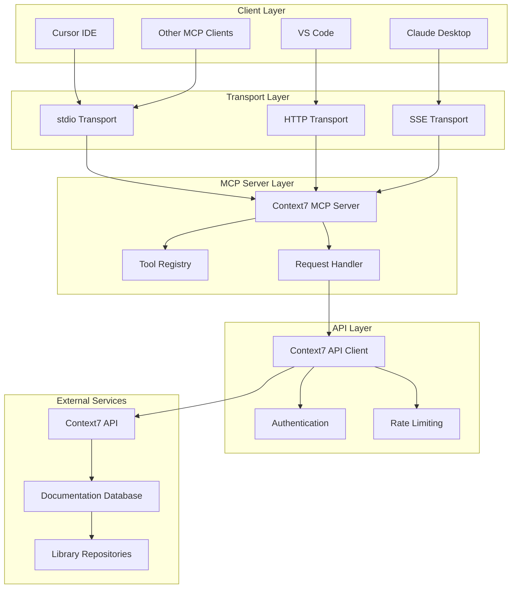
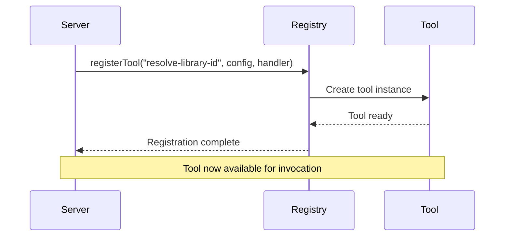
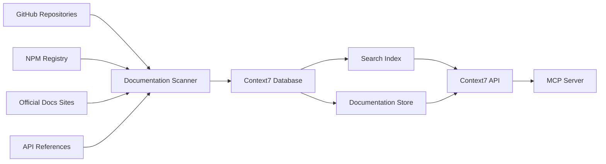
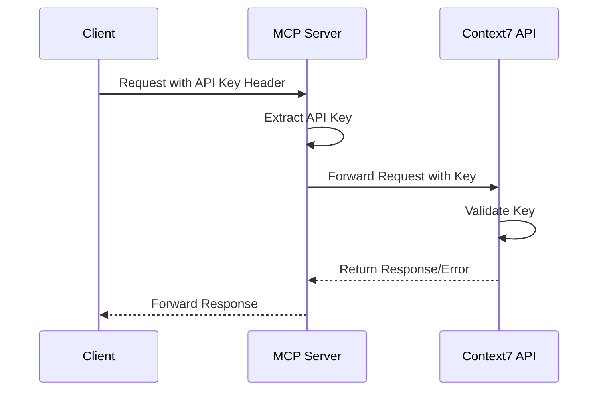

# System Architecture

## 🏗️ High-Level Architecture

Context7 MCP follows a layered architecture that separates concerns and enables flexible deployment options.



## 🧩 Core Components

### MCP Server Core
The central component that implements the Model Context Protocol specification.

**Key Responsibilities:**
- Protocol compliance and message handling
- Tool registration and lifecycle management
- Transport abstraction
- Error handling and logging

**Implementation Details:**
```typescript
// Server initialization with metadata
const server = new McpServer(
  {
    name: "Context7",
    version: "1.0.13",
  },
  {
    instructions: "Use this server to retrieve up-to-date documentation and code examples for any library.",
  }
);
```

### Tool Registry
Manages the available tools that AI assistants can invoke.

**Available Tools:**
1. `resolve-library-id` - Library search and identification
2. `get-library-docs` - Documentation retrieval

**Tool Lifecycle:**


### Transport Abstraction
Supports multiple communication protocols for different deployment scenarios.

#### stdio Transport
- **Use Case**: Local development, CLI integration
- **Advantages**: Simple, direct, low latency
- **Configuration**: Default transport mode

#### HTTP Transport  
- **Use Case**: Remote deployment, containerized environments
- **Advantages**: Scalable, stateless, firewall-friendly
- **Configuration**: Requires port specification

#### SSE Transport
- **Use Case**: Real-time applications, streaming responses
- **Advantages**: Persistent connections, event-driven
- **Configuration**: Built on top of HTTP transport## 🔧 Request Processing Pipeline

### Library Search Flow
```mermaid
flowchart TD
    A[User Query: "react hooks"] --> B[resolve-library-id Tool]
    B --> C[Parse Query]
    C --> D[Generate Search Request]
    D --> E[Context7 API Call]
    E --> F[Search Algorithm]
    F --> G[Fuzzy Matching]
    G --> H[Trust Score Calculation]
    H --> I[Result Ranking]
    I --> J[Format Response]
    J --> K[Return Library IDs]
```

### Documentation Retrieval Flow
```mermaid
flowchart TD
    A[Library ID: "/facebook/react"] --> B[get-library-docs Tool]
    B --> C[Validate Library ID]
    C --> D[Apply Topic Filter]
    D --> E[Set Token Limit]
    E --> F[Context7 API Call]
    F --> G[Documentation Database]
    G --> H[Content Filtering]
    H --> I[Token Counting]
    I --> J[Format Documentation]
    J --> K[Return Formatted Docs]
```

## 📊 Data Flow Architecture

### Information Sources


### Caching Strategy
Context7 implements multi-layer caching for optimal performance:

1. **API Response Cache**: Short-term caching of API responses
2. **Documentation Cache**: Medium-term caching of processed documentation
3. **Search Result Cache**: Long-term caching of search results
4. **Client-Side Cache**: Browser/IDE level caching where applicable

### Error Handling Architecture
```typescript
// Layered error handling approach
try {
  const response = await fetchLibraryDocumentation(libraryId, options, clientIp, apiKey);
  return formatResponse(response);
} catch (apiError) {
  if (apiError.status === 429) {
    return handleRateLimit();
  } else if (apiError.status === 404) {
    return handleNotFound();
  }
  return handleGenericError(apiError);
}
```

## 🔒 Security Architecture

### Authentication Flow


### Header Priority Chain
Context7 checks multiple header formats for maximum compatibility:

1. `Authorization: Bearer <token>`
2. `Context7-API-Key: <token>`
3. `X-API-Key: <token>`
4. `context7-api-key: <token>`
5. `x-api-key: <token>`

### Network Security
- **HTTPS Only**: All external communication uses TLS
- **Proxy Support**: Respects corporate proxy configurations
- **IP Filtering**: Optional client IP identification for rate limiting
- **CORS Handling**: Proper CORS headers for web-based clients

## 🎯 Performance Characteristics

### Latency Profile
- **Local stdio**: <50ms typical response time
- **HTTP transport**: 100-300ms depending on network
- **API calls**: 200-800ms depending on documentation size

### Throughput Limits
- **Default Rate Limits**: Generous for typical usage
- **API Key Benefits**: Higher limits for authenticated users
- **Concurrent Requests**: Handled efficiently with connection pooling

### Resource Usage
```typescript
// Configurable resource limits
const MINIMUM_TOKENS = 1000;      // Minimum doc size
const DEFAULT_TOKENS = 5000;      // Default doc size  
const DEFAULT_PORT = 3000;        // Default HTTP port
```

---

*This architecture ensures Context7 MCP is scalable, secure, and performant while maintaining simplicity for users.*

#architecture #mcp #system-design #performance #security

## See Also
- [[MCP Protocol Implementation]] - Protocol-specific details
- [[Transport Mechanisms]] - Communication layer details
- [[Security Model]] - Security implementation
- [[05-Development/Code Structure]] - Implementation details