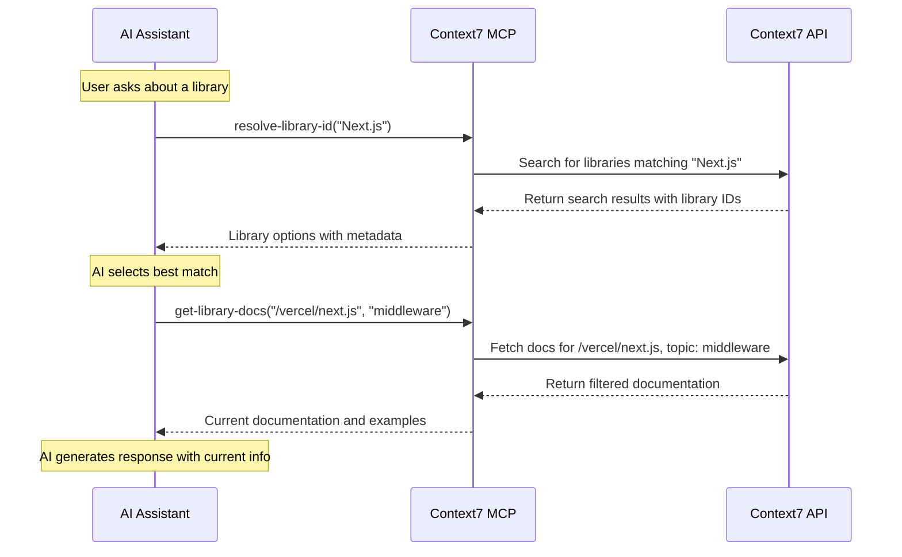
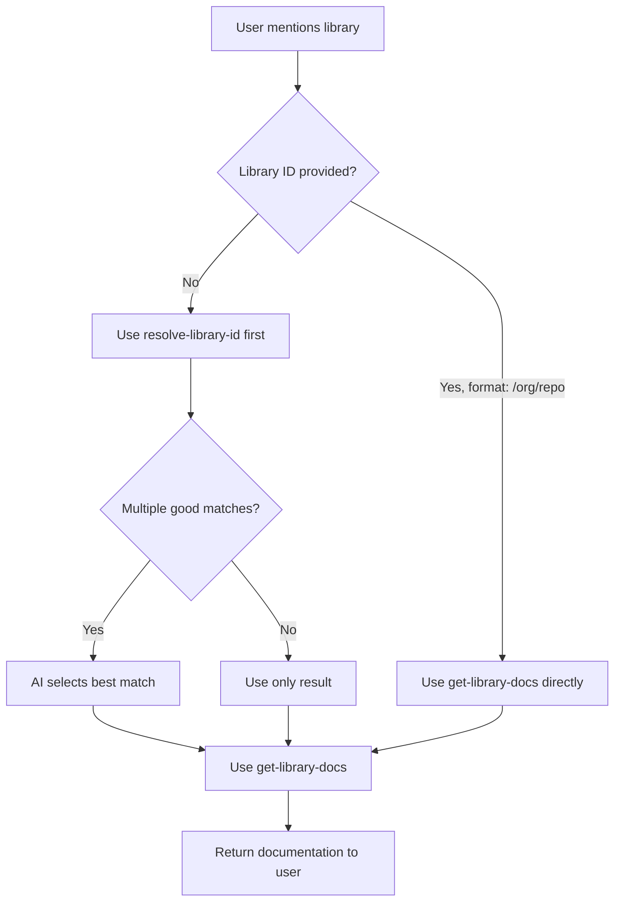

# API Overview

## 🔌 Context7 MCP API Reference

Context7 MCP exposes two primary tools through the Model Context Protocol for AI assistants to access up-to-date library documentation.

## 📋 Tool Summary

| Tool Name | Purpose | Required Parameters | Optional Parameters |
|-----------|---------|---------------------|---------------------|
| `resolve-library-id` | Search and identify libraries | `libraryName` | None |
| `get-library-docs` | Retrieve documentation | `context7CompatibleLibraryID` | `topic`, `tokens` |

## 🔄 Typical Usage Flow



## 🛠️ Tool Specifications

### Tool Registration Pattern
Each tool follows this registration pattern in the MCP server:

```typescript
server.registerTool(
  "tool-name",
  {
    title: "Human Readable Title",
    description: "Detailed description of what the tool does...",
    inputSchema: {
      parameter1: z.string().describe("Parameter description"),
      parameter2: z.number().optional().describe("Optional parameter"),
    },
  },
  async (parameters) => {
    // Tool implementation
    return {
      content: [
        {
          type: "text",
          text: "Tool response content"
        }
      ]
    };
  }
);
```

## 📊 Response Format Standards

### Success Response Structure
All successful tool responses follow this format:

```typescript
{
  content: [
    {
      type: "text",
      text: "The actual response content..."
    }
  ]
}
```

### Error Response Structure
Error responses maintain the same structure but with error information:

```typescript
{
  content: [
    {
      type: "text", 
      text: "Error description and guidance for resolution"
    }
  ]
}
```

## 🎯 Design Principles

### Simplicity First
- Minimal required parameters
- Sensible defaults for optional parameters
- Clear, actionable error messages

### AI-Friendly Responses
- Structured, parseable output
- Rich metadata for decision making
- Contextual information for selection

### Performance Optimized
- Configurable response sizes
- Smart caching strategies
- Efficient parameter validation

## 🔍 Parameter Validation

### Input Sanitization
```typescript
// Example validation for library ID
const validateLibraryId = (id: string): boolean => {
  // Must start with / and contain org/repo pattern
  return /^\/[a-zA-Z0-9\-._]+\/[a-zA-Z0-9\-._]+/.test(id);
};

// Token count validation with minimum enforcement
const validateTokens = (tokens: number): number => {
  return tokens < MINIMUM_TOKENS ? MINIMUM_TOKENS : tokens;
};
```

### Error Prevention
- Parameter type coercion where appropriate
- Automatic correction of common mistakes
- Helpful error messages with examples## 🔧 Advanced Usage Patterns

### Conditional Tool Usage
AI assistants should use this decision tree for optimal tool usage:



### Error Recovery Strategies
When tools fail, follow these recovery patterns:

1. **Library Not Found**: Suggest alternative search terms
2. **API Rate Limit**: Inform user and suggest retry
3. **Documentation Empty**: Verify library ID format
4. **Network Issues**: Provide fallback guidance

### Performance Optimization Tips

#### For Library Search
- Use specific library names when possible
- Include relevant context in search terms
- Avoid overly generic terms like "database" or "web"

#### For Documentation Retrieval
- Use topic filters to get focused results
- Adjust token counts based on complexity needs
- Cache results when making multiple related queries

## 🧪 Testing and Validation

### Tool Response Validation
Responses should be validated for:
- Proper content structure
- Non-empty meaningful content
- Appropriate length for context
- Actionable information

### Integration Testing Patterns
```typescript
// Example test pattern for tool validation
describe('Context7 Tools', () => {
  test('resolve-library-id returns valid library IDs', async () => {
    const response = await resolveLibraryId('react');
    expect(response.content[0].text).toContain('/facebook/react');
  });
  
  test('get-library-docs returns documentation', async () => {
    const response = await getLibraryDocs('/facebook/react', 'hooks');
    expect(response.content[0].text).toContain('useState');
  });
});
```

## 🔗 Integration Guidelines

### Best Practices for MCP Clients
1. **Always validate tool availability** before invoking
2. **Handle errors gracefully** with user-friendly messages  
3. **Implement reasonable timeouts** for tool calls
4. **Cache results appropriately** to avoid redundant calls
5. **Respect rate limits** and implement backoff strategies

### Authentication Considerations
- API keys are optional but provide better rate limits
- Keys should be configured at the transport level
- Different header formats supported for compatibility

---

*This API overview provides the foundation for understanding Context7 MCP's tool interface. See individual tool documentation for detailed specifications.*

#api #mcp #tools #integration #reference

## See Also
- [[Tools Reference]] - Detailed tool specifications
- [[Search Libraries API]] - resolve-library-id details
- [[Get Documentation API]] - get-library-docs details
- [[Error Handling]] - Error management strategies