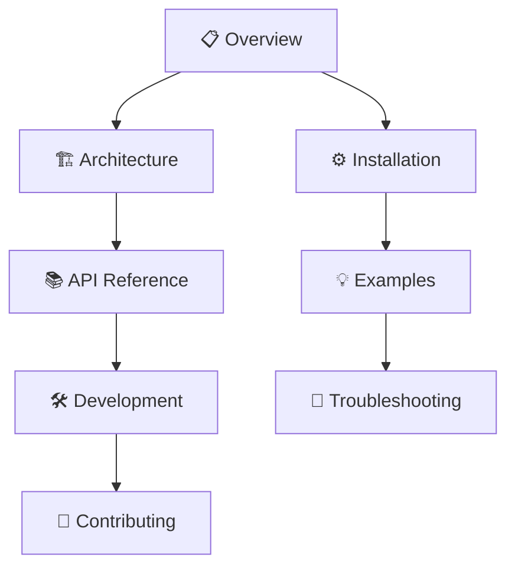

# Context7 MCP - Desktop Commander Claude Fork


## 🎯 Quick Navigation

| Section | Description | Links |
|---------|-------------|-------|
| **📋 Project Overview** | What is Context7 MCP and why it matters | [[01-Project-Overview/What is Context7]] |
| **🏗️ Architecture** | Technical design and system overview | [[02-Architecture/System Architecture]] |
| **📚 API Reference** | Complete API documentation | [[03-API-Reference/API Overview]] |
| **⚙️ Installation** | Setup guides for all platforms | [[04-Installation/Installation Guide]] |
| **🛠️ Development** | Development setup and workflows | [[05-Development/Development Setup]] |
| **🤝 Contributing** | How to contribute to the project | [[06-Contributing/Contributing Guide]] |
| **💡 Examples** | Practical usage examples | [[07-Examples/Usage Examples]] |
| **🔧 Troubleshooting** | Common issues and solutions | [[08-Troubleshooting/Common Issues]] |

## 🔥 What is Context7 MCP?

Context7 MCP is a Model Context Protocol (MCP) server that provides **up-to-date documentation and code examples** for any library directly in your AI coding environment. Say goodbye to outdated code generation and hallucinated APIs!

### Key Features

- ✅ **Real-time Documentation**: Always current, never outdated
- ✅ **Version-Specific**: Get docs for exact library versions
- ✅ **Multi-Platform**: Works with Cursor, VS Code, Claude Desktop, and more
- ✅ **Easy Integration**: Just add "use context7" to your prompts
- ✅ **Extensive Library Support**: Thousands of libraries indexed

## 🚀 Quick Start

### 1. Install Context7 MCP
Choose your preferred method:
- [[04-Installation/Cursor Installation|Cursor Setup]]
- [[04-Installation/VS Code Installation|VS Code Setup]]
- [[04-Installation/Claude Desktop Installation|Claude Desktop Setup]]

### 2. Use in Your Prompts
```
Create a Next.js middleware that checks for a valid JWT in cookies. use context7
```

### 3. Get Perfect Code
Context7 fetches the latest Next.js documentation and provides accurate, working code.

## 📖 Documentation Map



## 🏷️ Tags

#context7 #mcp #documentation #api #nodejs #typescript

## 📝 Recent Updates

- [[00-Index/Changelog]] - All project updates
- [[00-Index/Roadmap]] - Future development plans

---

*This vault contains comprehensive documentation for the Context7 MCP project. Use the navigation above or browse the folder structure to explore specific topics.*