# Context7 MCP - Desktop Commander Claude Fork


> 🎥 **Live Stream Demo**: This fork was created during a live coding session demonstrating how [Desktop Commander](https://desktopcommander.app/) in Claude can generate comprehensive, well-structured documentation that works seamlessly in both Obsidian and GitHub.
> 
> **📺 Watch the stream**: [Creating Obsidian & GitHub-friendly Documentation with Desktop Commander](https://www.youtube.com/live/523coCdL8ZI)

## 🛠️ About Desktop Commander

[Desktop Commander](https://desktopcommander.app/) is a powerful MCP (Model Context Protocol) server that gives Claude direct access to your desktop environment. It enables Claude to:

- 📁 **File System Operations**: Read, write, and manage files and directories
- 🔍 **Search & Analysis**: Find and analyze content across your projects
- 🏃 **Process Management**: Run commands and scripts
- 📊 **Data Processing**: Work with CSVs, logs, and other data formats

**This documentation vault itself was created using Desktop Commander**, showcasing how AI can help generate professional-grade documentation with proper structure, cross-references, and dual compatibility for both Obsidian and GitHub!

## 🎯 Quick Navigation

| Section | Description | Links |
|---------|-------------|-------|
| **📋 Project Overview** | What is Context7 MCP and why it matters | [What is Context7](01-Project-Overview/What%20is%20Context7.md) |
| **🏗️ Architecture** | Technical design and system overview | [System Architecture](02-Architecture/System%20Architecture.md) |
| **📚 API Reference** | Complete API documentation | [API Overview](03-API-Reference/API%20Overview.md) |
| **⚙️ Installation** | Setup guides for all platforms | [Installation Guide](04-Installation/Installation%20Guide.md) |
| **🛠️ Development** | Development setup and workflows | [Development Setup](05-Development/Development%20Setup.md) |
| **🤝 Contributing** | How to contribute to the project | [Contributing Guide](06-Contributing/Contributing%20Guide.md) |
| **💡 Examples** | Practical usage examples | [Usage Examples](07-Examples/Usage%20Examples.md) |
| **🔧 Troubleshooting** | Common issues and solutions | [Common Issues](08-Troubleshooting/Common%20Issues.md) |

## 🔥 What is Context7 MCP?

Context7 MCP is a Model Context Protocol (MCP) server that provides **up-to-date documentation and code examples** for any library directly in your AI coding environment. Say goodbye to outdated code generation and hallucinated APIs!

### Key Features

- ✅ **Real-time Documentation**: Always current, never outdated
- ✅ **Version-Specific**: Get docs for exact library versions
- ✅ **Multi-Platform**: Works with Cursor, VS Code, Claude Desktop, and more
- ✅ **Easy Integration**: Just add "use context7" to your prompts
- ✅ **Extensive Library Support**: Thousands of libraries indexed

## 🚀 Quick Start

### 1. Install Context7 MCP
Choose your preferred method:
- [Cursor Setup](04-Installation/Cursor%20Installation.md)
- [VS Code Setup](04-Installation/VS%20Code%20Installation.md)
- [Claude Desktop Setup](04-Installation/Claude%20Desktop%20Installation.md)

### 2. Use in Your Prompts
```
Create a Next.js middleware that checks for a valid JWT in cookies. use context7
```

### 3. Get Perfect Code
Context7 fetches the latest Next.js documentation and provides accurate, working code.

## 📖 Documentation Map

```mermaid
graph TD
    A[📋 Overview] --> B[🏗️ Architecture]
    A --> C[⚙️ Installation]
    B --> D[📚 API Reference]
    C --> E[💡 Examples]
    D --> F[🛠️ Development]
    E --> G[🔧 Troubleshooting]
    F --> H[🤝 Contributing]
```



## 🏷️ Tags

#context7 #mcp #documentation #api #nodejs #typescript #desktop-commander #obsidian #github

## 🔗 Related Projects

- **[Desktop Commander](https://desktopcommander.app/)** - The MCP server that made this documentation possible
- **[Original Context7 Repository](https://github.com/upstash/context7)** - The upstream project this fork is based on

## 📝 Recent Updates

- [Changelog](00-Index/Changelog.md) - All project updates
- [Roadmap](00-Index/Roadmap.md) - Future development plans

---

*This vault contains comprehensive documentation for the Context7 MCP project. Use the navigation above or browse the folder structure to explore specific topics.*

**🎯 Documentation Features:**
- ✅ **Obsidian Compatible**: Full linking and navigation in Obsidian
- ✅ **GitHub Compatible**: All links work perfectly on GitHub
- ✅ **Auto-Conversion**: Pre-commit hooks convert `[[]]` links to relative markdown links
- ✅ **Live Demo**: Created live on stream with Desktop Commander + Claude